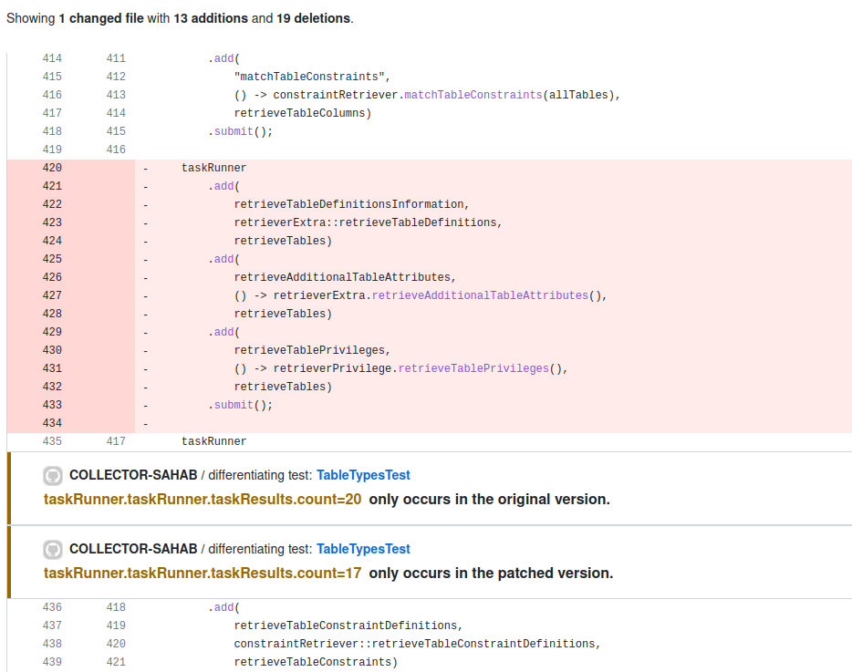

# Collector Sahab

[](https://github.com/algomaster99/collector-sahab/actions/workflows/tests.yml)
[](https://github.com/ASSERT-KTH/collector-sahab/actions/workflows/it.yml)
[](https://maven-badges.herokuapp.com/maven-central/io.github.chains-project/collector-sahab)

Collector Sahab is a tool to augment code diffs with runtime information. It works by instrumenting and running the versions before and after a commit, and then report the differences found in the runtime values.
For more information, see our paper [Augmenting Diffs With Runtime Information](http://arxiv.org/pdf/2212.11077) (IEEE Transactions on Software Engineering, 2023, doi:[10.1109/TSE.2023.3324258](https://doi.org/10.1109/TSE.2023.3324258)).

## Example Diff



## Releases

Our releases are signed using `travis-gumtree-spoon`'s GPG key. The key is hosted
[here](https://keyserver.ubuntu.com/pks/lookup?op=get&search=0x1429025e3eda19a5).
You may run the following commands to verify the signature of a release.
```shell
gpg --recv-keys 1429025e3eda19a5
gpg --verify collector-sahab-<VERSION>-jar-with-dependencies.jar.asc
```
> This signature is a type of [detached signature](https://en.wikipedia.org/wiki/Detached_signature),
> so you need to have the JAR file as well to verify the signature.

## Structure of the project

The project is divided into multiple submodules.
1. `commons`: Contains common classes used by other modules.
1. `main`: The main module which contains the CLI and runs all the following modules.
1. `matched-line-finder`: A submodule which is used to find the _non-diffed_ line numbers
   in the left and right commits.
1. `trace-collector`: A submodule which is a java agent which collects runtime data
   and writes it to a file.
1. `trace-diff`: A submodule which is used to find the diff between the runtime data
   collected by `trace-collector` in the left and right commits.


## Execution

### Prerequisites

   Please install `gawk` before proceeding. Use the following command.
```shell
$ sudo apt install gawk
```

You also need to have ChromeDriver installed at path `/usr/bin/chromedriver`.
Run the following command to get it:
```shell
$ sudo apt install chromium-chromedriver
```

And finally, a maven project hosted on GitHub. :smile:

### Setup project for collecting runtime statistics

1. Package the entire project
    ```bash
   $ mvn package -DskipTests
    ```
2. (Optional) Run the tests
    ```bash
   $ mvn test
    ```

3. Prepare for execution of `collector sahab` by running. The following are the required parameters.
   ```bash
   $ java -jar main/target/collector-sahab-1.0-SNAPSHOT-jar-with-dependencies.jar \
          -p <path/to/project>
          -l <left-commit>
          -r <right-commit>
          -c <relative/path/to/classfile>
          --slug <orgName/repoName>
   ```
   The following are the optional parameters.
   1. `--execution-depth` (integer): The depth of the stack trace to be collected. Default is `0`.
   1. `--selected-test` (list of tests separated by comma): The tests to be executed. Default is `[]` which
      runs every test in the target project.
   2. `--output-path` (string): The path where the output will be stored. Default is `output.html`.
   3. `--cleanup` (boolean): Whether to clean up the temporary files created during execution. Default is `false`.
   4. `--exclude-random-values` (boolean): Whether to exclude random values in trace. Example: path to temporary files. Default is `false`.

   Following parameters have not been added to `main`, but planned to be added in the future if needed.
   
   1.  `numberOfArrayElements`: The number of array elements to be collected. Default is `20`.

   2. `extractParameters`: Whether to extract parameters of the method. Default is `false`. 


## Example trace

 ```json
{
   "breakpoint": [
         {
            "file": "foo/BasicMath.java",
            "lineNumber": 5,
            "stackFrameContext": [
            {
               "positionFromTopInStackTrace": 1,
               "location": "foo.BasicMath:5",
               "stackTrace": [
                  "add:5, foo.BasicMath",
                  "test_add:11, foo.BasicMathTest",
                  "runTest:40, se.kth.debug.JUnitTestRunner",
                  "lambda$main$0:16, se.kth.debug.JUnitTestRunner",
                  "call:-1, se.kth.debug.JUnitTestRunner$$Lambda$1.81628611"
               ],
               "runtimeValueCollection": [
                  {
                     "kind": "LOCAL_VARIABLE",
                     "name": "x",
                     "type": "int",
                     "value": 23,
                     "fields": null,
                     "arrayElements": null
                  },
                  {  
                     "kind": "LOCAL_VARIABLE",
                     "name": "y",
                     "type": "int",
                     "value": 2,
                     "fields": null,
                     "arrayElements": null
                  }
               ]
            }
         ]
      },
      {
         "file": "foo/BasicMath.java",
         "lineNumber": 9,
         "stackFrameContext": [
            {
               "positionFromTopInStackTrace": 1,
               "location": "foo.BasicMath:9",
               "stackTrace": [
                  "subtract:9, foo.BasicMath",
                  "test_subtract:16, foo.BasicMathTest",
                  "runTest:40, se.kth.debug.JUnitTestRunner",
                  "lambda$main$0:16, se.kth.debug.JUnitTestRunner",
                  "call:-1, se.kth.debug.JUnitTestRunner$$Lambda$1.81628611"
               ],
               "runtimeValueCollection": [
                  {
                     "kind": "LOCAL_VARIABLE",
                     "name": "x",
                     "type": "int",
                     "value": 2,
                     "fields": null,
                     "arrayElements": null
                  },
                  {
                     "kind": "LOCAL_VARIABLE",
                     "name": "y",
                     "type": "int",
                     "value": 1,
                     "fields": null,
                     "arrayElements": null
                  } 
               ]
            }
         ]
      }
   ]
}
```
